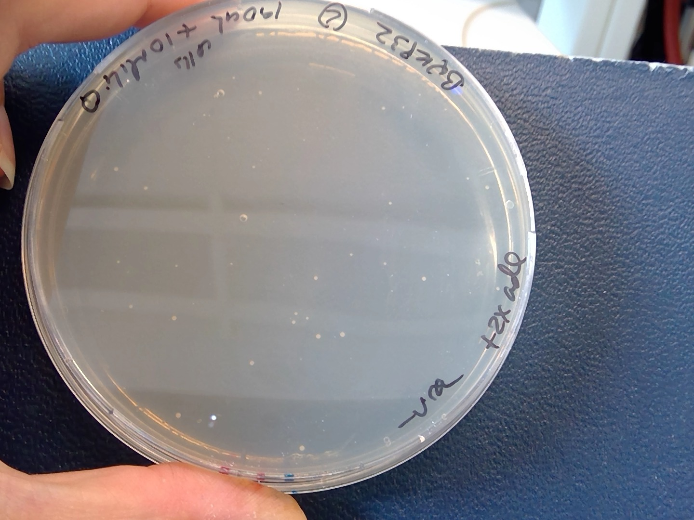
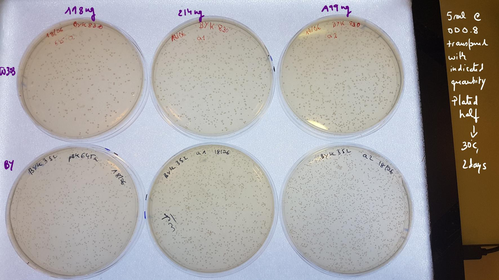

# Title : 10072019-Byk832 transformation using pBK549 plasmid (:ok:)

# Date

10072019

# Objective
 - To insert into the genome the PbK49 plasmid, see [previous attempts of transformation](C:\Users\linigodelacruz\Documents\PhD_2018\Documentation\Experimental_Journal\journal\2019-06/2019-06-20_Exp_Byk832_transformation_pbk549.md)
 - To see if changing the protocol of transformation, from Biotech, by using an exponential growing culture, give better results.

# Method

- To ensure an exponential growing culture I incubated Byk832 the 08072019 by morning
- Dilute 1000x times 09072019 afternoon to a final volume of 10 ml
- Use the overnight culture in 10072019 which had an OD of 1,4.
- I diluted again to an OD of 0.2 in 10ml media volume at 9:00
- Centrifugation of samples at max 6000g for 5 secs
- Decrease the time with LiAc before adding the centrifugation mix.
    > For this, between the step of adding LiAc until 1,5mL final volume, after the MiliQ washing, what I did, was washing the cells with LiAc 1mL and then centrifuged them and add 1ml of MiliQ, because it would be too much time in LiAc, if after putting 1mL , centrifuge and resuspend again in LiAc for distributing the samples in the labelled tubes. So I wait, until the ssDNA was heated at 95C for 5 min and put it in ice, so I centrifuged the cells in MiliQ, discard it, and resuspend in **80 ul LiAc for a final volume of 100ul**.

    > Actually, they used to resuspend to a final volume of 500ul, for an initial volume of 50 ml of cells. I started with 5ml so I should have used 50ul as a final volume for LiAc, instead I used 100ul, so 2x more diluted mixture.
- I mixed the transformation mix one by one component. First I added the PEG 240 ul and mixed throughly by pippeting in and out, then the LiAc 1M concentration 36ul , and 25ul od denaturated ssDNA and finally 10ul of 10.3ng/ul pBK549 plasmid.
- I did not see clumpy cells this time :) this observation could be associated to high centrifugation speed and long times with LiAc before adding the transformation mix.
- I plate all cells 200ul MiliQ from sample 1 and 190ul cells +10 ul Miliq from sample 2 and 10ul cells +190 ul MiliQ , ad all from the negative control in **-URA+2x ADE**. This means 40ul of 1000x ADE stock in a 20ml plate.

# Results
- Today, 12072019 I can see some colonies in the selective plates , from the 190ul cells+10ul MiliQ plating. Byk832+ 100ng pBK549 plasmid 🙂

- Still the efficiency is very low compared with Agnes transformation from ETH 👇

- On 15072019 after weekend incubation in 30C

  - pink cells!

# Conclusion
- The transformation efficiency was very low compared with the reference one. 
- We have to streak the colonies on -ade plates and see wether we have only few growth and a lot of growth on -ura (sanity check)
