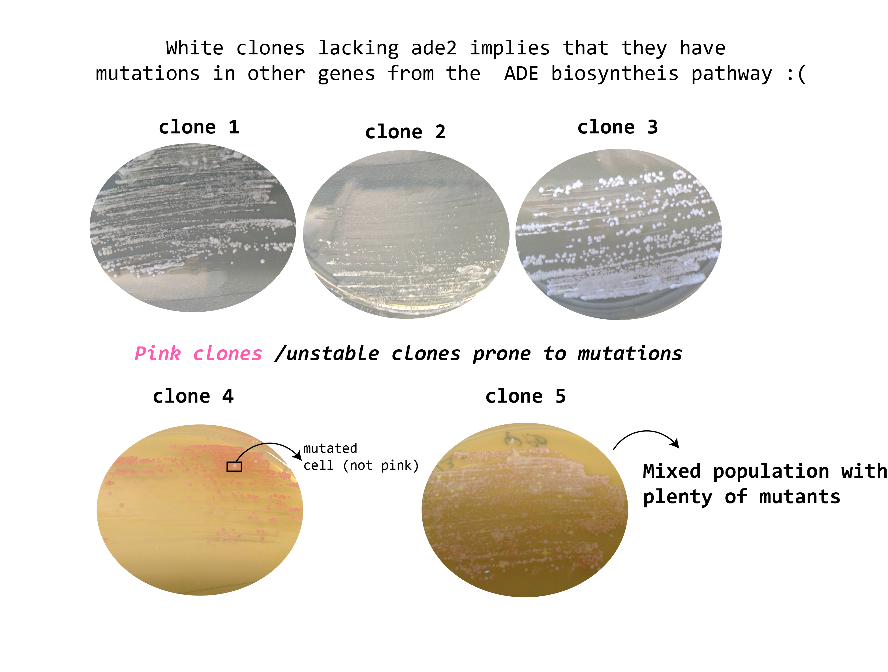
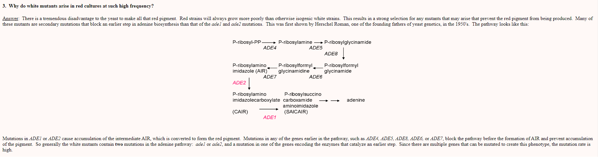
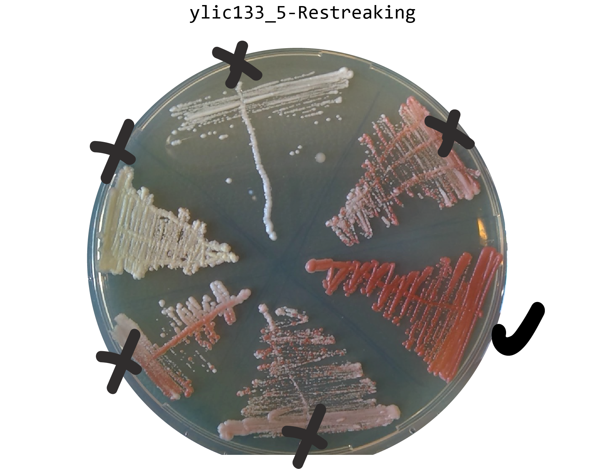
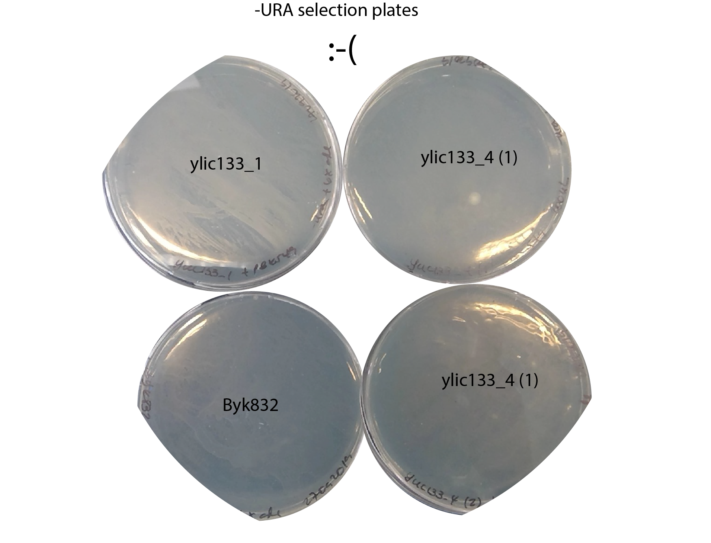

---
title: "24092019- pBK549 transformation on ylic133 for further sanity check in SATAY."
output: pdf_document
documentclass: article
classoption: twocolumn
pdf_document:
latex_engine: pdflatex
toc: true
lof: true
numberSections: true
highlight: tango
sectionsDepth: 3
chapters: True
figPrefix:
  - "Fig."
  - "Figs."
secPrefix:
  - "Section"
  - "Sections"
fontsize: 12pt
geometry: margin=0.5in
autoEqnLabels: true
cref: true
crossref: true
colorlinks: true
---

# Title : 24092019- pBK549 transformation on ylic133 for further sanity check in SATAY. :pensive:

# Date
24092019-30092019

# Objective
To ensure that the constructed strain is able to pass the Satay sanity check , and then I can continue with the further steps, like mating with yEK7a.

# Method
- 24092019 16:30 Plating in YPD plates all glycerol stocks of the different biologcal replicates.
  - 26092019-Results of the plating in YPD
   
- 26092019
  - 13:50 Inoculation of one single colonie from ylic133_4 plate, and a bit more than a colony of ylic133_4 as well , Byk832 and one single white colony from ylci133_1 in YPD+6xADE (that was the amount Enzo used for the last succesful pBK549 transformation=0.055g of ADE in 500 ml of media) [ Look here into the pBK549 transformation on 05082019](../2019-08/2019-08-05_Exp-Byk832-transformation-with-pBK549.md).  This is to decrease the changes of supressors that supress the pink phenotype. This inoculation is to transform them with pBK549 plasmid.
  - Use Byk832 as a positive control for the transformation. Inoculate it at the same time as the pink ylic133 clones and one yellow to reconfirm that this clone can not be used for SATAY.

  - See the following picture from [ this page](https://www.phys.ksu.edu/gene/GENEFAQ.html)  to confirm that the yellow phenotype I see in some of the ylic133 clones is because mutations in some other ade genes in the adenine biosynthesis pathway.

  
- 26092019 - restreaking of different colonies from clone 5 of ylic133, to hopefully clean up the glycerol stock.

   
   - 30092019 store one colony from the pink restreaking as new ylic133_5 glycerol stock
- 27092019 - pBK549 plasmid transformation
  - OD measurements 9:55

  |   | OD-10X dilution |Titer   |Dilution factor to OD=0.5   |Time|
  |---|---|---|---|---|
  | ylic133_1  |1.263  | 12.6  | 25.2  | 9:55 |
  | ylic133_4 (1)  |1.843   |18.4  | 36.8  | 9:55 |
  | ylic133_4 (2)  |1.417   | 14.1  | 28.2  | 9:55 |
  | Byk832  |0.063  | 0.6  | 1.2  | 9:55 |
  - The ylic133_4 tubes were not pink yet, I think this make sense due to the excess of adenine that the media have.
  - 10:15 1st incubation until around 14:15 , to reach log phase for transformation.
  - 13:30 OD measurements

  |   | OD-10X dilution |Titer   |Time|
  |---|---|---|---|
  | ylic133_1  |0.158  | 1.6  |  13:30 |
  | ylic133_4 (1)  |0.088  |0.9 |  13:30  |
  | ylic133_4 (2)  |0.140   | 1.4  |  13:30  |
  | Byk832  |0.063  | 0.34  | 13:30  |
  - I diluted 2x Byk832 down to OD=1.7 because still the rest are not ready to start.

  - 14:40 OD measurements

  |   | OD-10X dilution |Titer   |Ready to transform |Time|
  |---|---|---|---|---|
  | ylic133_1  |0.34  | 3.4  |yes | 14:40 |
  | ylic133_4 (1)  |0.114  |1.1 | let's see , should be ~2  | 14:40  |
  | ylic133_4 (2)  |0.28   | 2.8  | yes | 14:40  |
  | Byk832  |0.24  | 2.4  | yes | 14:40  |

- 100ng of pBK549 plasmid
- **Note**: The cells after adding the transformation mix were really clumpy, so they did not properly dissolved in the transformation mix, which can hinder the transformation efficiency.
- Plating all in -ura+6xADE
# Results :pensive:
-30092019 - No colonies in -URA plates , in none of the four strains used :( There is just a loan

# Conclusion
- Indeed, it seems the fact that the cells were clumpy place a role on the transformation. This happens to me as well with Byk832 in previous transformations, see [**this transformation**](../2019-07/2019-07-10_Byk832-transformation-pBk549.md)
- Repeat the transformation , and try to minimize again the time in LiAc and mix every time tha transformation mix on the cells to avoid formation of clumps.
