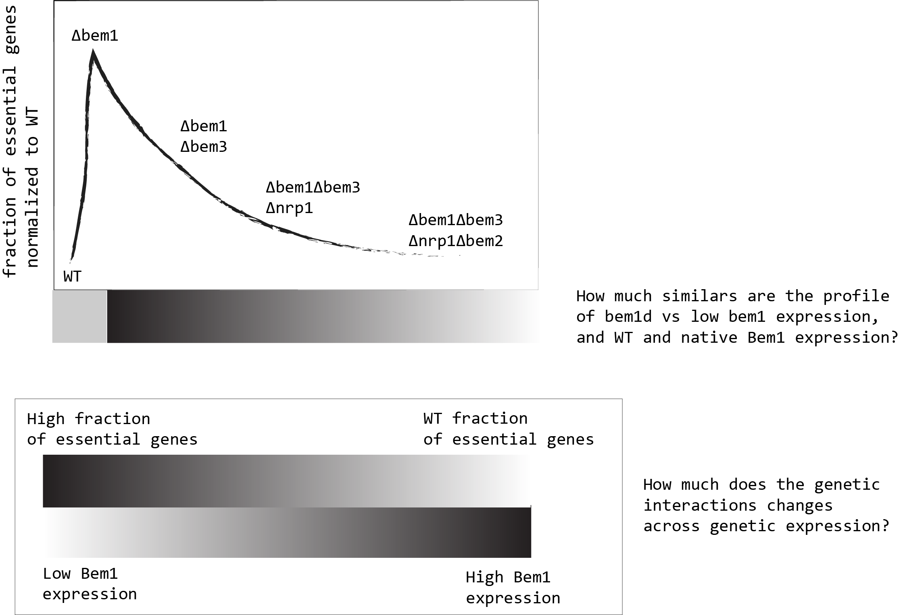

# Balance of the 2019 and outlook to the 2020

## Main acivities/tasks/things done in 2019

- **Experimentally related**
  - Transformation the yll3a to have the desired genotype for SATAY. (ylic133: *MAT $\alpha$ can1-100 leu2-3,112 his3-11,15 BUD4 from S288C ,ade2 ura3^0*)
  - Passed sanity check (previous step for SATAY) for this strain. See here : [Documentation](../2019-10/2019-10-09-Sanity-check-ylic133+pBk549.md)
  - Hands on FACS technique and data analyis.
- **Theoretical related**
  - Computing the correlation between annotated genetic interactions and the number of common interactors genes. See [Here](..\2019-08\2019-08-16-some-plots-gene_int-data.md)
  - Think about applying machine learning methods to learn patterns from the already existing vast amount of data , about genetic interactions, functions and phenotype in Saccharomyce cerevisae. See [Here for projects](../2020-01/2020-01-07-machine-learning-proposal-projects.md)
- **Daily practices**
  - Building a more practical way of documenting daily experiments, for myself and for the public. The main features are:
    - Using a local *electronic labnotebook* with the aid of the text editor [Atom](https://atom.io/) and the [Journal-package](https://atom.io/packages/journal), to keep track of the time for each entry.
    - Integration with **git** for version control. Git is a distributed version-control system for tracking changes in source code during software development. This is useful to allow pushing the documentation to an online repository, in order to be able to collaborate easily with remote collaborators.
    - This framework allows the easy use of website generators that compile the markdown documents for the public , and it is also a nice way to present your work. The one I use is [VuePress](https://vuepress.vuejs.org/). My website for the lab-journal can be found [here](https://leilaicruz.github.io/Experimental-journal-deploy/)
    - The advantadge of this framework is that is easily integrable with other methods, and it is aligned with the Open science practices. ALso importantly, it is **Free,Open source**, **Internet is not required in order to  produce content**.
    - Collaboration is very easy through this method, because there is any barrier to others be included in it (just to have a github/gitlab account).
    - Moreover, it is more resilient than to just use a comercial existing electronic lab notebooks (like [Lab Journal](https://www.elabjournal.com/), [lab Folder](https://www.labfolder.com/),etc) due to the fact that the data is more redistributed (local and online) and it is not under the control of those private companies servers.
    - Also, the exporting of pdf documentation is much more well presented using markdown-pandoc parser integration than to use the export options of these commercial electronic lab notebooks.
    - Also, documenting skills/co-creation/authenticity are facilitated at using this framework.
- **Capacities acquired**
  - Python programming for experimental data analysis and visualization.
  - Cloning of yeast strains
  - Markdown use and deploy of web pages using Vuepress.
- **PhD practicalities**
  - Passed in June the GO-No-GO meeting.
  - Discipline related skills ECTS: 15
  - Transferables related skills ECTS: 7
  - Research related skills ECTS: 2.5

## Reflections

What was the predominante mindset n the previous year , regarding the scope/meaning of my PhD?
- The 2019 was a year of exploration and and learning mainly documentation and  programming  skills.

## Perspectives for 2020

### Designed plan to accomplish in the next 3 years
### Perspective on the next three years (Project Plan)
- [ ] Finish the Fridtjof paper, about the evolution of self organization related functions,a nd integrate this results with my original PhD.
- [ ] Write a paper with the results of the mapping of essential/non essential genes from the *bem1$\Delta$* , *bem1$\Delta$bem3$\Delta$* and *bem1$\Delta$bem3$\Delta$nrp1$\Delta$* backgrounds. ($\Delta$ - symbolyze knockout)
- [ ] Write a paper about, how gene expression can influence genetic interactions in bem1$\Delta$ strains. Specifically, how Cdc42 changes in gene expression  can alter the SATAY map of essential and non-essential genes of the Bem1 deleted strain. Or perhaps, engineer a *bem1* promoter to control its native expression in the cell.
- [ ] Write a paper about how the  correlation between type of interactions and shared interactors, can be extended to more than one gene deletion. Basically is asking the question, how in a double deleted background, can we identify possible positive, negative and synthetic lethal interactions? with the results of SATAY with strains with multiple mutations.
- [ ] Test that in order to *nrp1*  be deleted to improve the overall fitness of the organism, in *bem1$\Delta$bem3$\Delta$* background, the hub genes *cla4*, *cdc3* and *act1* have to be present. Therefore, I am planning to perform a "short" evolution experiment starting with *bem1$\Delta$bem3$\Delta$* background to test the *nrp1* deletion in 4 different genetic lines:

-  *bem1$\Delta$bem3$\Delta$cdc3$\Delta$*
-  *bem1$\Delta$bem3$\Delta$act1$\Delta$*
-  *bem1$\Delta$bem3$\Delta$cla4$\Delta$*

### "Realistic plan" , after 6 months from the GO-NO-GO meeting:
- [ ] Write a paper with the results of the mapping of essential/non essential genes from the *bem1$\Delta$* , *bem1$\Delta$bem3$\Delta$* and *bem1$\Delta$bem3$\Delta$nrp1$\Delta$* backgrounds.
- [ ] Write a paper about, how gene expression can influence genetic interactions in bem1$\Delta$ strains. Specifically, how Cdc42 changes in gene expression  can alter the SATAY map of essential and non-essential genes of the Bem1 deleted strain. Or perhaps, engineer a *bem1* promoter to control its native expression in the cell.

#### What is the connection between them?

{#fig:bem1-expression-depency}
