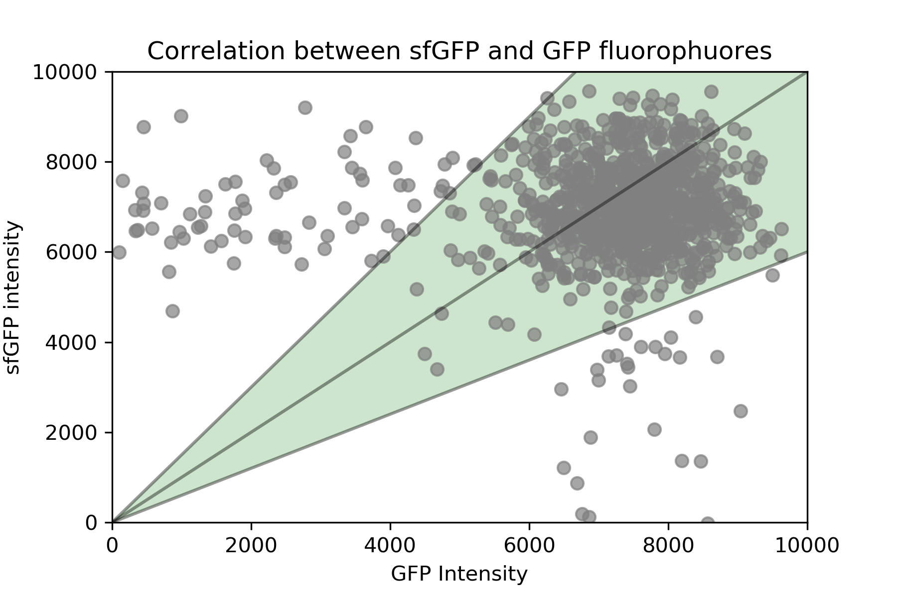

## FACs

#### Media:
The media used for incubation of the yeast strains was *Complete Supplement Mixture* (CSM) and CSM without methionine (CSM-MET). The sugar source used was raffinose for growth and galactose to express the Gal1 promoter. We did not use dextrose in our experiments for his known effect on inhibiting the expression of the galactose promoter in yeast [**REF:Flick, J. S., & Johnston (1990). Two systems of glucose repression of the GAL1 promoter in Saccharomyces cerevisiae. Molecular and Cellular Biology, 10(9), 4757-4769.**].

#### Strains:

The yeast strain used are ywkd065,ywkd069, ywkd070, ywkd001, ywkd24 and ywkd038. For their details in their genotype , see Table **XXX**.

#### Incubation details:

The yeast strains used in this study were first incubated in 2% Galactose at 36C[^1], for 24 hours. After this time, they were washed out with CSM/CSM-MET(depending on their genotype) and resuspended in this media. Subsequently, they were transfer to the galactose concentrations used in this study, namely, 0%,0.01%,0.02%,0.06%,0.08%,0.1%,0.2% and 2% Galactose. The incubation in these concentrations was for 24 hours more before measuring, in 36C.

[^1]: This was the incubation temperature used for the population growth experiments, were we could observe a bigger phenotype across the tested strains. Since, we want to use the same galactose concentrations as used in the population growth study, we needed to be in the same regime by keeping the same incubation conditions in all the experiments.

#### Flow cytometry specifications:
For the flow cytometry experiments, we used the BDFACSCelesta model. For the lasers, we used primary laser (argonion laser 488 nm) to excite the cells with a voltage of 495V. The plate we used was a flat bottom 96 well plate. Each well was filled with a volume of 200 ul of cell culture. We used 407V for the *Forward Scattering* (FSC) voltage, and 275V for the *Side Scattering* (SSC) voltage. Each event for the FSC was acquired if the voltage signal surpassed the 20000 value. 

**ADD THE CALIBRATION KIT USED BEFORE MEASURING-ASK DIEGO**

## Controls

#### Comparable expression between sfGFP and GFP:

In this study we used different strains for the flowcytometry measurements that has different fluorophuores, namely, GFP and sfGFP.

In order to compare them, we plot the emission from ywkd065 (pGal1-Cdc42-sfGFP) against ywkd024 (Cdc42-pGal1-Cdc42-GFP) at 2% galactose.

As it is shown in @fig:correlation, most of the values lie between the y=1.5x and y=0.6x lines. This shows that their emissions are comparable.
This is highly important in our study because we use a native Cdc42-GFP tagged strain as a reference for the Cdc42-sfGFP tagged strain that has the GAl1 promoter regulating this production.

{#fig:correlation width=80X height=80X}

#### No growth for longer times in 0% galactose:

We confirmed that in 0% galactose there is no growth of the strains that has the Cdc42 production controlled by the Gal1 promoter.

Although,in the setup used in this study, we could measured cells in 0% galactose, we tested for longer incubation times in this galactose concentration to confirm that all the cells die, as expected.

We let them grow for 48 hours in 0% galactose from the glycerol stock, then we did a flow cytometry measurement and we found there was no cells in any well.
This was reflected in the lack of values for those wells containing 0% galactose.

#### Data analysis

We used a Python library called FlowCytometryTools(https://pypi.org/project/FlowCytometryTools/) for the postprocessing of data.
For the analysis, we import the raw data and visualize the FSC vs SSC to define our gates. We gated the data that has similar values of FSC and SSC. We exclude the points with large values on both of them, to avoid analyzing debris or clumps of cells.. Per experiment we compute the geometric mean per replicate, as an individual measure of the distribution of intensities. The final value of the intensity per strain per condition will be the arithmetic mean of all the geometric mean values per replicate. The standard error will be the error of this mean, that will reflect the variability across replicates. After the 3 experiments , we compute the arithmetic mean  of the respective means values per experiment per strain per condition, and the standard error is the standard error of this global arithmetic mean.
