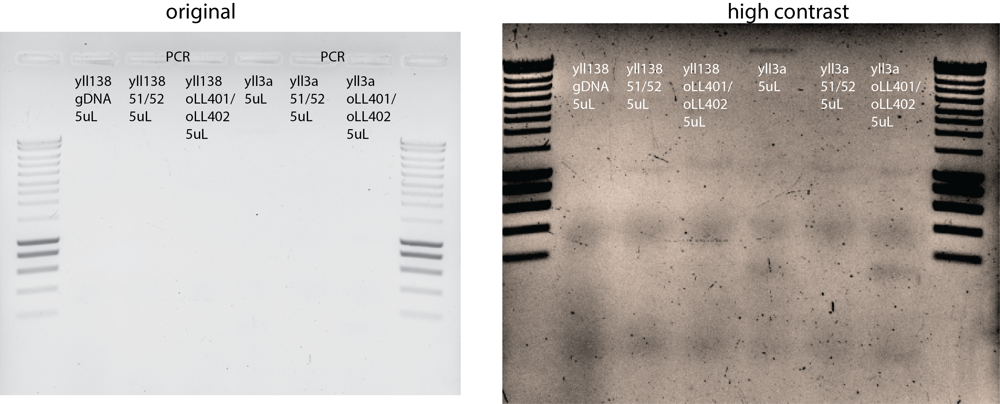
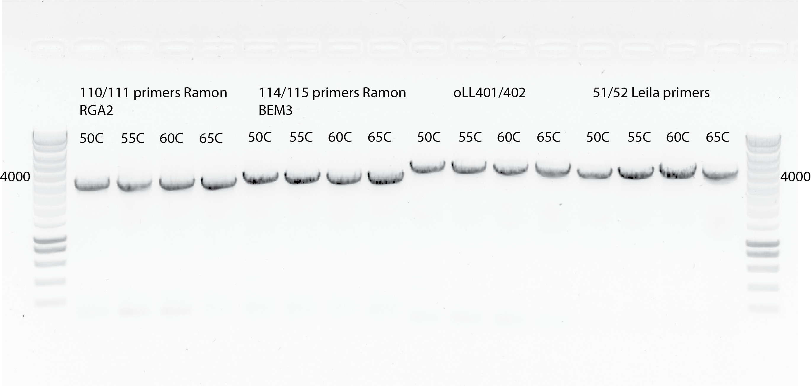
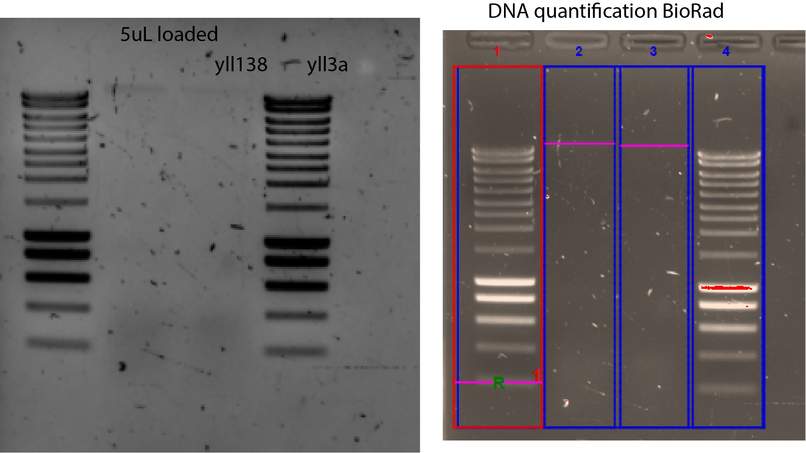
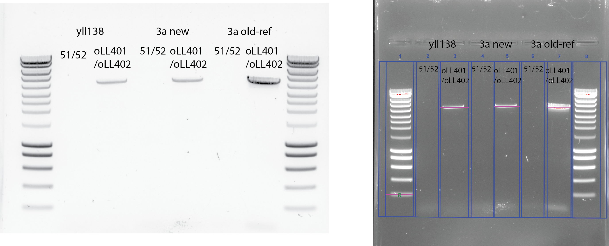
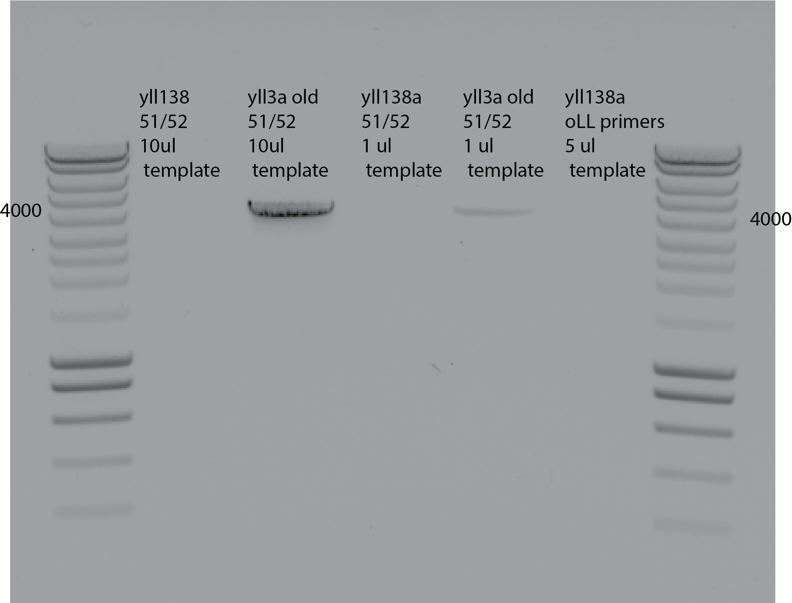

# Title : gDNA extraction of yll138

## Date
17112020

## Objective

-To have gDNA to make the PCR in order to transform ylic133 and make a bem3$\Delta$ for SATAY.

## Method

- Genomic DNA extraction using the Roboklon KIT

- I pulled the pellet of 4ml of culture for one extraction. 
- I used in total 4 tubes with 4ml of culture
- I preheated the elution buffer at 55C before eluting it. 
- I eluted 10ul per tube , so in total I have around 40uL of DNA.
- Nanodrop concentration: 15ng/uL 
  - A260: 0.3
  - A280: 0.1
  - 260/280 : 2.6
  - 260/230: 1.6

- PCR 
  - Protocol Leila (block A machine upstairs)
    - 95C 3mins

    do 35x cycles:
    - 95C  30secs
    - 55C 30secs
    - 72C 1min

    end cycle
    - 72C 5mins
    - 12C on hold 

  - 2ul of DNA
  - Primers 51/52 and oLL401/oLL402
  - Adding also 2uL of DNA from yll3a as control. 

## Results

- 

## Next steps

- Annealing temperature gradient , with the following T: 50C, 55C , 60C and 65C with **2 mins** of extension time. Before was 1 min. 
- Also for the PCR , we used a new dilution of all primers (always vortexing them before diluting.)

- Using Ramon primers(110/111,114/115), Liedewij primers(oLL401/oLL402) and my primers (51/52). 

- New genomic DNA extraction (23112020)
  - 1.5ml of a highly dense culture per eppi
  - 5 DNA extraction per strain (yll138 and yll3a)
  - 30ul of elution
  - concentration on gel (5ul loaded) using BioRad

  

  - yll138 intensity = 0.4 x Intensity (20ng band) = 8ng/5ul ~ 1.5 ng/ul 
  - yll3a intensity = 0.2 x Intensity (20ng band) = 4ng/5ul ~ 1 ng/ul 
  - **These are really low numbers**

- PCR with those genomic DNA and the old DNA that previously worked!
  - Use 5ul DNA template for the new extraction and 1ul of the old yll3a stock
  - Use oLL401/oLL402 and 51/52 primers , newly diluted from the original stock.
  - Use 60C annealing temperature and 2 mins in 72C for the extension. 

  - My primers 51 and 52 did not work while Liedewij's primers did work. 
  - Concentration of the PCR product using BioRad
    - Intensity(yll138)= 12.66 * Intensity (20ng)=253.2/5ul=50.64 ng/uL
    - Intensity(yll3a)= 13.43 * Intensity (20ng)=268.6/5ul=53.72 ng/uL

- One interesting point from this result is that the length of the PCR product from yll138 that have bem3::NAT is the same as the WT. From previous PCR the PCR product size with 51/52 primers is roughly the same as with oLL401/oLL402 in the yll3a (old reference) template. 

- If I have enough PCR product to do both transformations I will continue with it , and check if they acquire NAT resistance , then I will know they are the right clones. Anyways I will send to sequence those clones and I will see what is in there. 
 
    
### Troubleshooting the PCR 

- Another PCR with 10ul and 1ul from yll138 DNA and 10ul and 1ul from yll3a DNA (old reference) with primers 51 and 52. 
  - To test more template and less buffer with the 1ul DNA that may hinder the efficiency of the PCR using yll138 as template. 

- Repeat 8 times the PCR using yll138 as template (5ul) with oLL401/oLL402 to have more PCR product for the transformation. 

## Next Steps

- Use a different strain for transformation , this one is causing too much problem and also not giving the right product as it has the same length as the WT, which should not be , given that BEM3 is not there. I will use the one from Wessel that has worked. 

## Conclusion

- It seems the extension time placed a role in the PCRs

- I wont continue with this strain (yll138) for transformation. 
- **I was overlooking the first step of the genomic extraction kit , which is the activation of the column with Buffer BG**. See [here](https://roboklon.com/pdf/81_det_en.pdf) the protocol for more details. So this was the reason why I was having so low yield. 😣😣