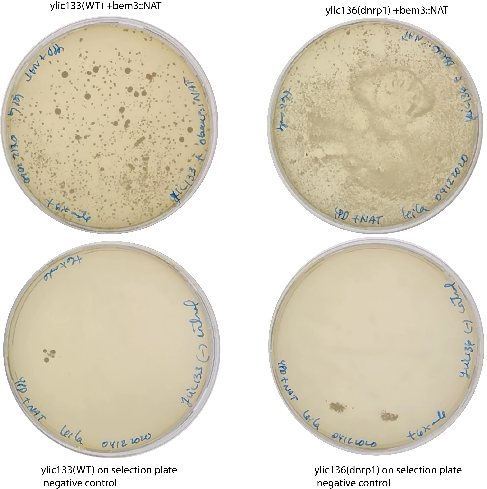

# Title: ylic133 and ylic136 transformation with bem3d::NAT

## Date
04122020-09122020

## Objective
- To get the following mutants for SATAY:
    - $\Delta$bem3 in the WT background
    - $\Delta$bem3 in the $\Delta$nrp1 background 

## Method

- [Yeast Transformation Protocol](../Protocols/Yeast-transformation.md)
- Culture 10ml of from each strain from glycerol stock (the afternoon before today) in YPD+6xADE to avoid adenine deficiencies. 
- OD measurement 
  -ylic133: 3.15
  -ylic136: 1.24
- I did not dilute them , so continue with this because they were in log phase. (In the morning they were not dense at all)
- Amount of DNA added: 10ul -> 10uL*260ng/uL=2.6ug 
- I included one negative control per strain
- Recovery time : 1h 20mins
- Plate the whole culture in the selection plates: YPD+NAT+6xADE
  - 1mL plated after recovery without any dilution. 

## Results

## Conclusion

- High efficient transformation :)
- The negative controls have some colonies, very localized in one place, which could mean that in that region there was not enough NAT. I spread NAT with glass beads. 

## Next steps

- Culture single colonies (6) per strain to freeze in glycerol stocks to check  later their integration with PCR.
  - Only 1 colony from the 6 colonies has densely grown after 24 hours in 30C incubation. I stored that one from each strain in glycerol stocks. 
  - I stored the plates with the transformants and the restreaking of dbem3dnrp1 single colonies to regrow them after January. (coming back from my holidays :D)