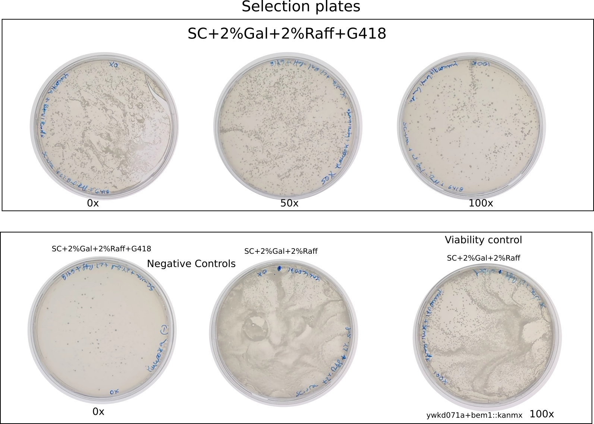
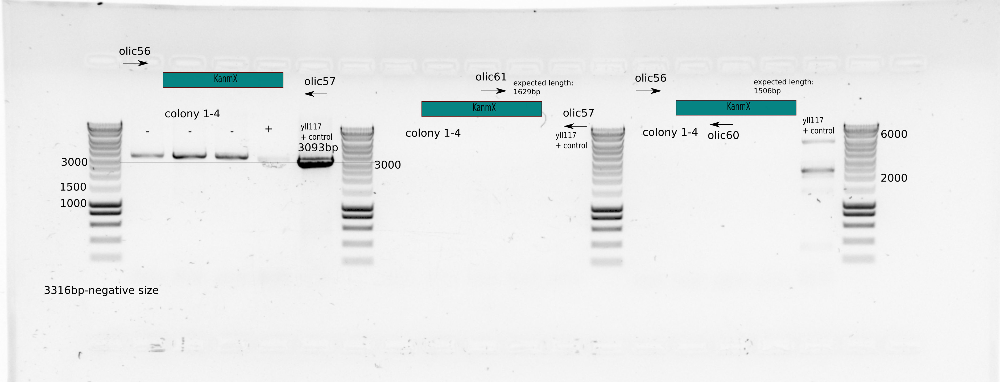
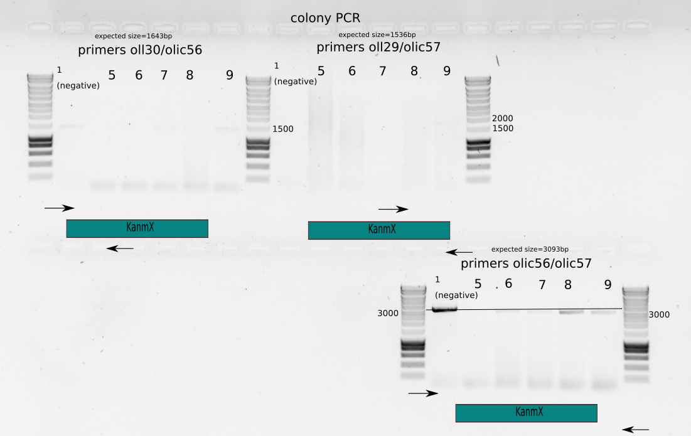
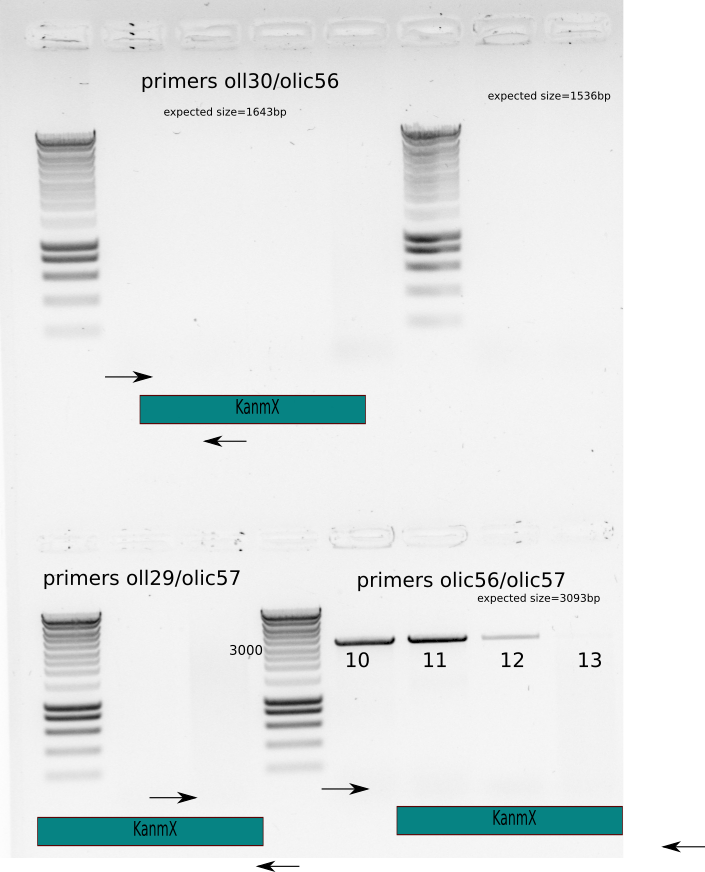
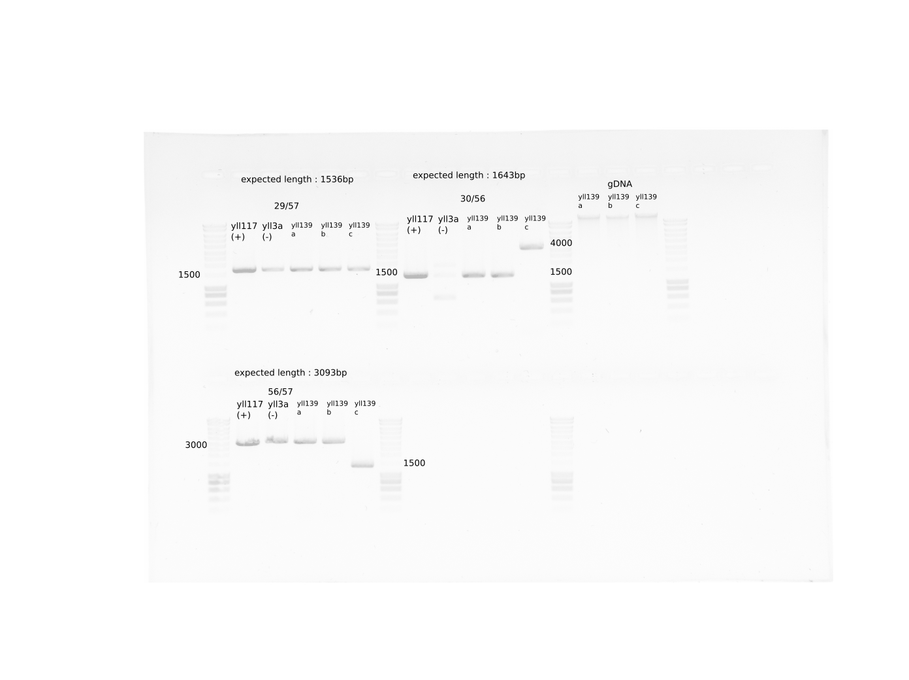
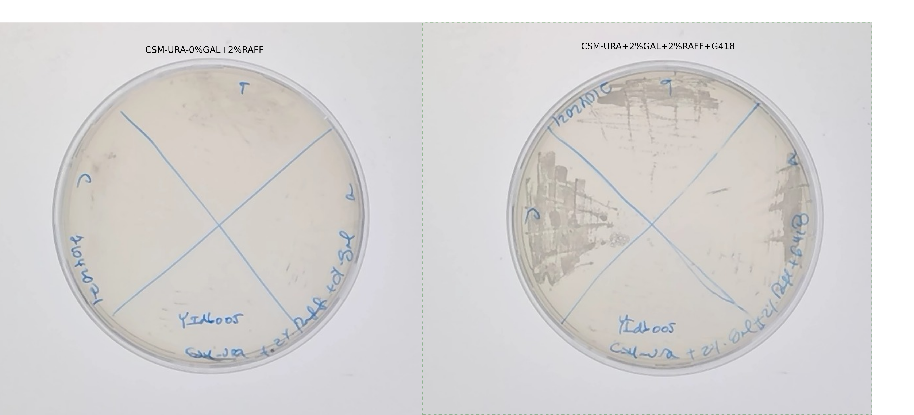

# Title : bem1::KanMX transformation in WT+pGal-CDC42

## Date

06042021-23042021

## Objective

-  To have this strain for the growth controls measurements needed for the paper with Fridtjof. 
- The strain we had yIdb005a,b are completely contaminated with WT. See the last results from [2021-01-25-Supp-controls-sfgFP-influence-to-paper](../2021-01/2021-01-25-Supp-controls-sfgFP-influence-to-paper.md)

## Method

- Yeast Transformation Protocol
- 06042021: Incubation of ywkd071a in SC-URA+2%Gal+2% Raff 
- 07042021: Culture not in log phase, only at late afternoon , around 15:00. I transfered the culture to room temperature to do the transformation on the next day. 
- 08042021: OD measurement

| strain   | OD 10x dilution | Real OD | Dilution to OD=0.5  | Real OD after dilution |
|----------|-----------------|---------|---------------------|------------------------|
| ywkd071a | 0.7             | ~7      | 10x                 | 0.4                    |

  - Incubation started at 9:00 

  - Start of transformation at 13:00 , with OD=1.3
  - 10ul of DNA from PCR bem1:KANmx (~200ng/uL) = 2ug DNA
  - 2h recovery step in SC-URA+2% Gal+2% Raff
  - Plate in selection plates (Sc-URA+2%gal+2%raff +G418)
    - 100ul 0x dilution (positive control) 
    - 100ul 50x dilution (positive control)  
    - 100ul 100X dilution (positive control)
    - 100uL 0X dilution (negative control) 
  - Plate in normal plates (SC-URA+2%gal+2%raff )
    - 100uL 100X dilution (positive control) 
    - 100uL 100X dilution (negative control) 
    
## Results

- Selection plates 

{#fig:selection-plates}

- Colony PCR with 4 from small to medium size colonies 
  - Primer sets: olic56/oll60, olic57/oll61, olic56/olic57
  - Colonies dissolved in 25ul MiliQ
  - 1uL for PCR 
  - PCR with Leila_LL_60 protocol : 60C annealing temperature, 2min in 72C and 30secs in 98C

{#fig:colony-pcr}

  - We can not say anything from Figure [@fig:colony-pcr] because it seems the primers oll60/61 dont work. It seems that colony 4 could had a band size for the external primers similar to the positive control, but it did not grow in plate. 

- Colony PCR of more colonies , one of them a big colony from the 100X selection plate. 
  - Primer sets: olic56/oll30, olic57/oll29, olic56/olic57
  - Colonies dissolved in 10ul MiliQ
  - Take 1ul for PCR 
  - PCR with Leila_LL_60 protocol : 60C annealing temperature, 2min in 72C and 30secs in 98C

{#fig:colony-pcr-colony-9}

From Figure [@fig:colony-pcr-colony-9] we can see that colony 9 shows all the exected  band sizes. Though it is very vague for the edge selection. 

  - [x] Put all the colonies to grow in SC-URA+2%GAL+2%Raff+G418. 

- Colony PCR with two more big colonies from the 100x selection plate and two more from the a re-streak plate. 

{width=50X}

  - could be because of the colony PCR
- 19042021-Liquid culture of colonies 10,12,13(they were like dehydrated, not wet colonies in the plate),and 9 , they were the ones that shows growth over-weekend in plates. 
  - Media: SC-URA+2%Gal+2% Raff+G418 

- [x] gDNA extraction from these colonies and glycerol stocks
- [x] PCR with primers oll29/57 , oll30/56 and olic56/57
- [x] Storing three biological replicates for glycerol stocks.Colony 9 did not grow . Strain name : ylic139
  - colony 10: a
  - colony 12: b
  - colony 13: c 

{#fig:pcr-with-gdna}

- Results from the Figure [@fig:pcr-with-gdna] 

  - replicate ylic139 c shows a weird band size for the upstream and correct integration. So it seems it does not have a correct integration. 
  - yll3a shows a band for the ptEF terminator , which should not be possible. 
  - The rest of the replicates seem fine. 

### Positive and negative checks for the glycerol stocks

**Negative controls**

- [x] Plate the replicates in SC-URA+2% RAff+0% Gal, including yIdb005a (the contaminated stock)
- [x] Inoculate them in liquid culture in SC-URA+2% Raff+0% Gal, including yIdb005a (the contaminated stock)

**Positive Controls**

- [x] plate them in SC-URA+2% RAff+2% Gal+G418 including yIdb005a,(the contaminated stock)

### Results

- Growth of replicates from glycerol stocks in SC-URA+2%Gal+2%Raf+G418. 
- No growth of yIdb005 in selection media (confirmation)
- Miserable growth after 5 days in 0% Gal of the replicates in plates. 
- Since the glycerols stocks are in 2% Gal they need to be dissolved in 0% Gal to dissolve the Cdc42. 

## Conclusion

- We have two biological replicates of new dbem1:KanMx pGal-cdc42::URA : ylic139 a, b . 