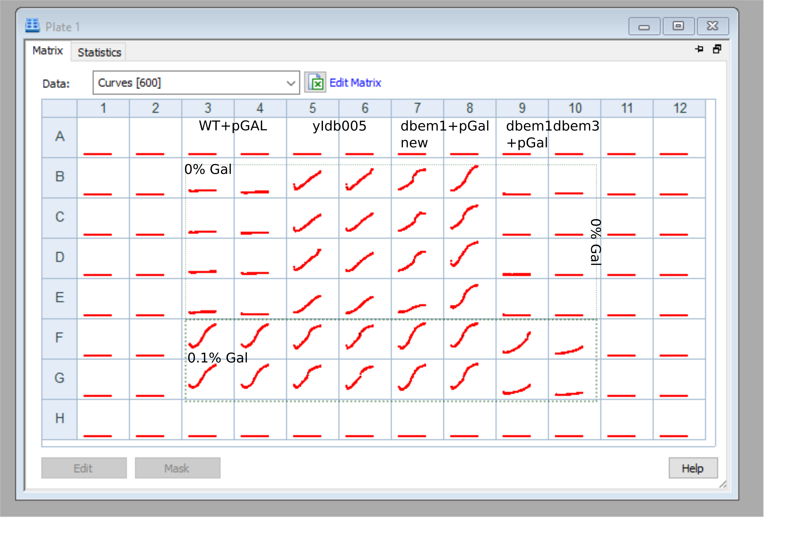

# Title : "Biotek experiment for new dbem1 pGal-cdc42 strain"

## Date
26042021-30042021

## Objective

- To check the phenotype and the population growth behaviour of the [new dbem1 +pGal-cdc42 strain](../2021-03/2021-03-30-dbem1-transformation-on-pgal-wt.md). 

## Method

- 1ul of glycerol stock in 100ul media
- incubation in 30C in the biotek
- Media base: 4xCSM-NF+2%Raff
    
- Plate layout:

- 200x dilution from incubation to measuring : 0.5ul cells in 100ul media. 

## Results

## Conclusion

- Notice that the new dbem1 strain do not grow in 0% Gal after 48hours of dilution in 0% Gal.
- The dbem1dbem3 strain seems very slow. 

