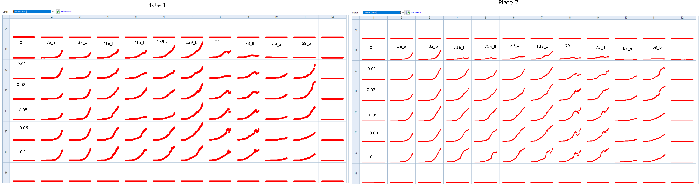

# Title: Biotek - 1st experiment for paper all strains

## Date

06052021-10052021

## Objective

- To check that the sfGFP do not influence the phenotype of the population growth of the pGal strains 

## Method

- Population growth rate in the Biotek
- Layout:Two plates 

- Incubation at 11:15
- Initial amount from thawed glycerol stock:

    - 5ul for ywkd073I and ywkd073II (from previous miserable growth)
    - 1ul for the rest 

- Measuring 08052021
  - 200x dilution for all strains 

## Results

### After incubation 

## Conclusion