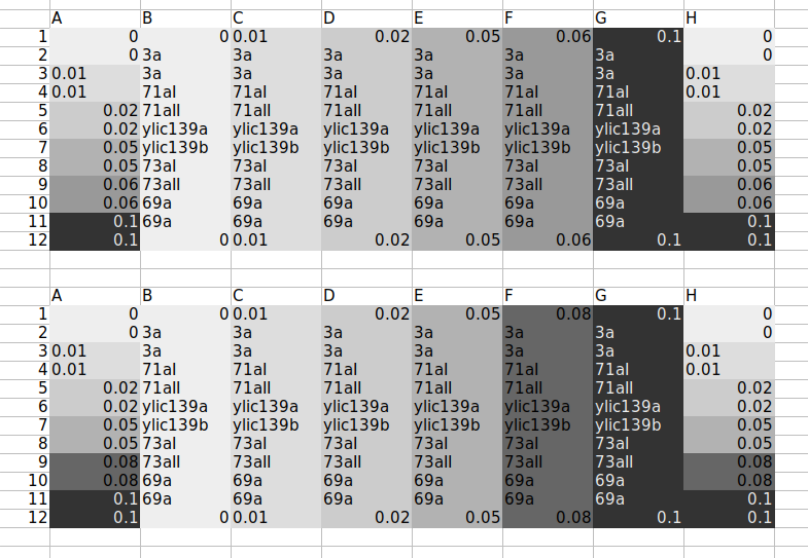
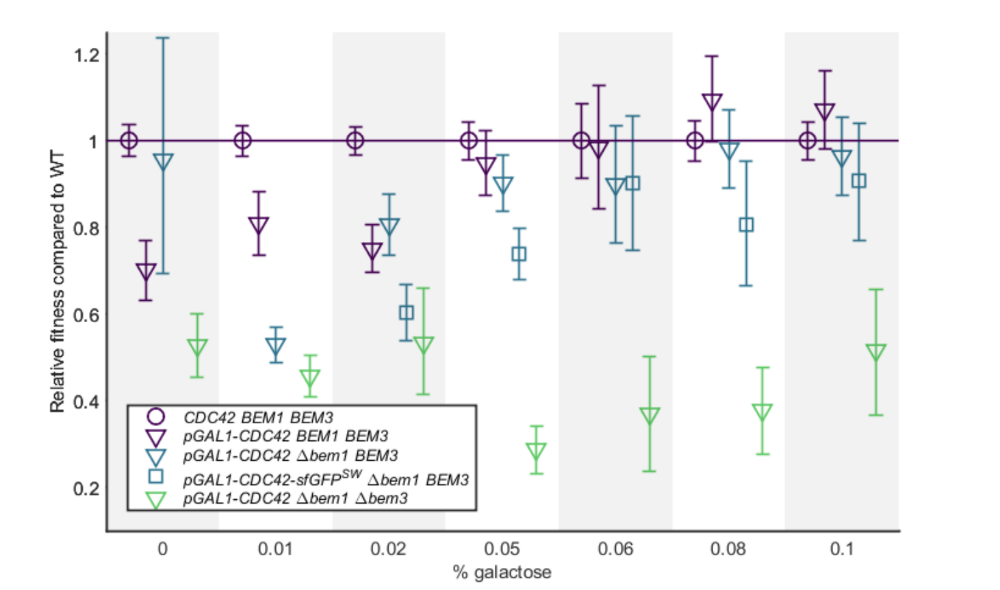

# Title:  Biotek - 2nd experiment for paper all strains

## Date

17052021-21052021

## Objective

- To check that the sfGFP do not influence the phenotype of the population growth of the pGal strains 

## Method

- Population growth rate in the Biotek
- Layout:Two plates 

- Initial amount from thawed glycerol stock:

    - 5ul for ywkd073I and ywkd073II (from previous miserable growth)
    - 1ul for the rest 
- Incubation started at 11:00 17052021

- Measuring 

  - 100x dilution for ywkd073I and ywkd073II
  - 200x dilution for the rest 

## Results

## Conclusion

- ywkd073 I and II remains unclear why it is growing in such a miserable way. 
- Comments by Werner:

If we disregard the Δbem1 Δbem3 GAL1-CDC42 for a second, we then observe a small deleterious
phenotype of the sfGFP addition in the Δbem1 background (Figure 1, top and Table 1). Both the
doubling time at low galactose concentration, as the critical galactose concentration itself goes up with
the addition of sfGFP, but this difference vanishes when sufficient Cdc42 is made. This suggests we
lose a bit of effective Cdc42 by addition of Cdc42, but this is a quantitative effect of sfGFP on our
results, not qualitative. The qualitative picture of Figure 3A of our paper would still hold up, where we
compare sfGFP strains in various genetic backgrounds.

- With these results we will send them to Fridtjof and plan a next meeting . 