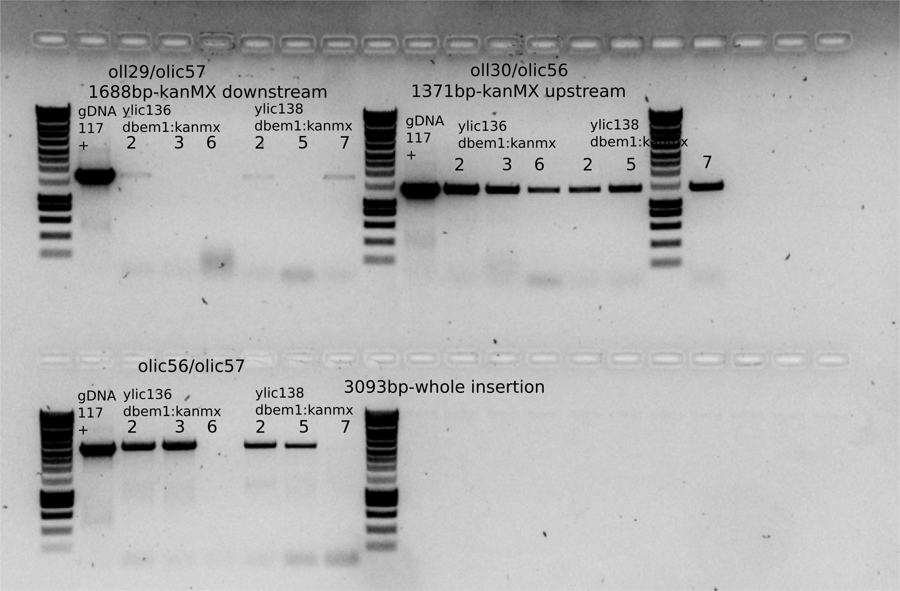

# Title: Transformation/checking on ylic136 and ylic138 with bem1::KANMX 

## Date

31052021-

## Objective

- To get the strain $\Delta$nrp1 $\Delta$bem1 and $\Delta$nrp1 $\Delta$bem3 $\Delta$bem1 for SATAY

## Method

- Yeast transformation protocol 
- Incubation in 10mL YPD + HYGRO+6xade for ylic136 and YPD+HYGRO+NAT+6x ade for ylic138 , at 10:20am. 

- 10ul of DNA from PCR bem1:KANmx (~200ng/uL) = 2ug DNA

- Recovery step : 1hour in YPD+6xade+HYGRO (1ml)

## Results

- After 2 days in 30C incubation

### Selection plates 

- No colonies for 0x dilution for ylic136 + bem1: kanmx , that is weird. 
- It seems the antibiotics were not splitted homogeneously throughout the plate because of the empty holes (heart shapes) in the middle of the 100x dilution plates. Also for the negative control.

### Colony PCR

- Selection of 8 colonies from the 100x dilution plates , they range from small to big size. 
- The small size colonies were diluted in 10ul MiliQ, medium in 15ul and big in 20ul. 
- After diluting the same clone was restreaked in selection plates. 
- For PCR , three colonies small , medium and big were selected per strain.
- Colony 2(small), 3(medium) and 6(big) from ylic136 and colony 2(medium), 5(big) and 7(small) from ylic138. 

- 1ul of template for PCR and yll117gDNA was also included as positive control. 
- LEILA60/LL was the PCR protocol

- It seems almost all clones are good with exception of clones 6 from ylic136.
- Clone 3 from ylic136 and 5 from ylic138 are dubious.
- It seems clone 2 from both strains is right. 

## Conclusion
