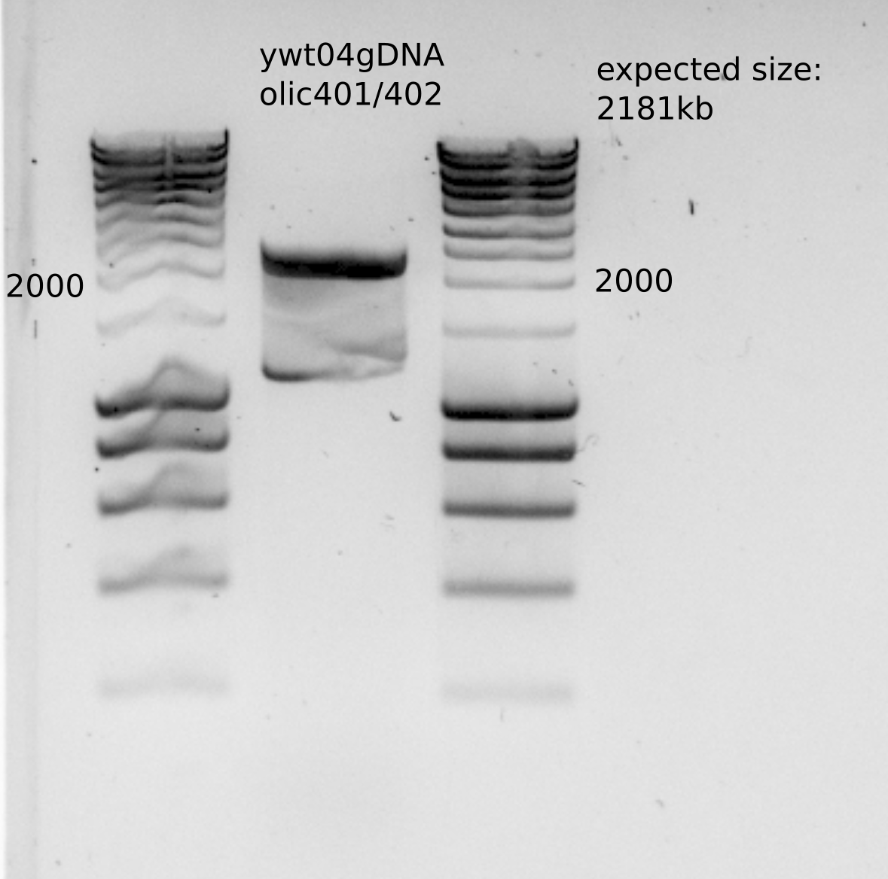
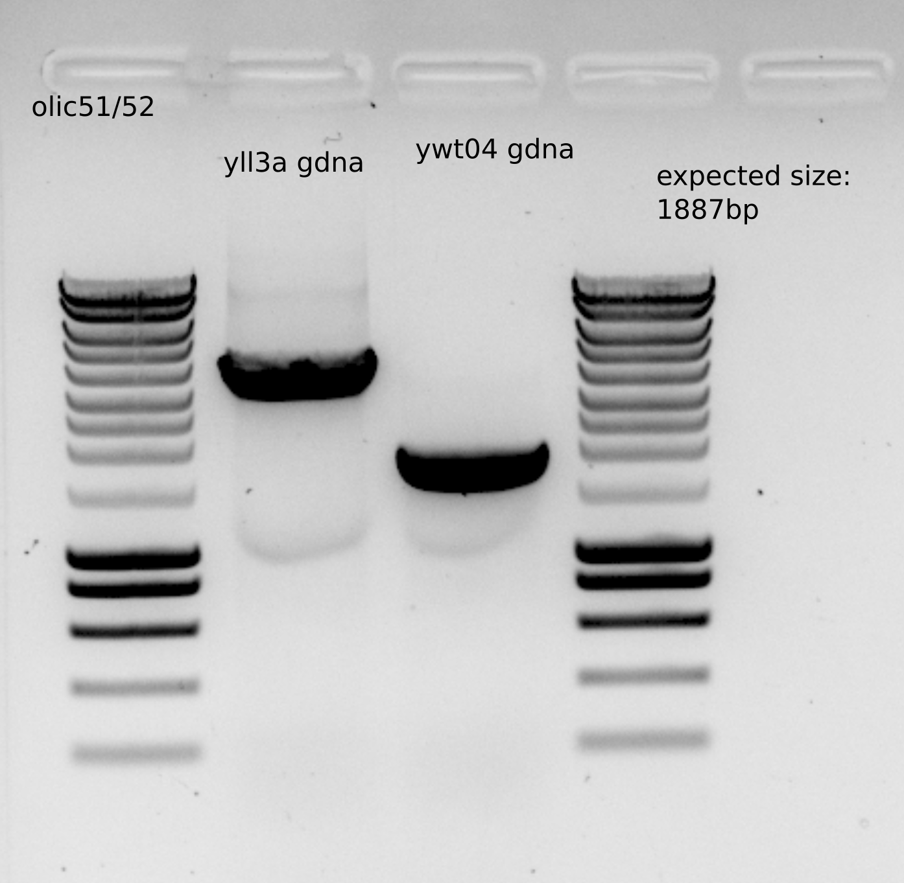
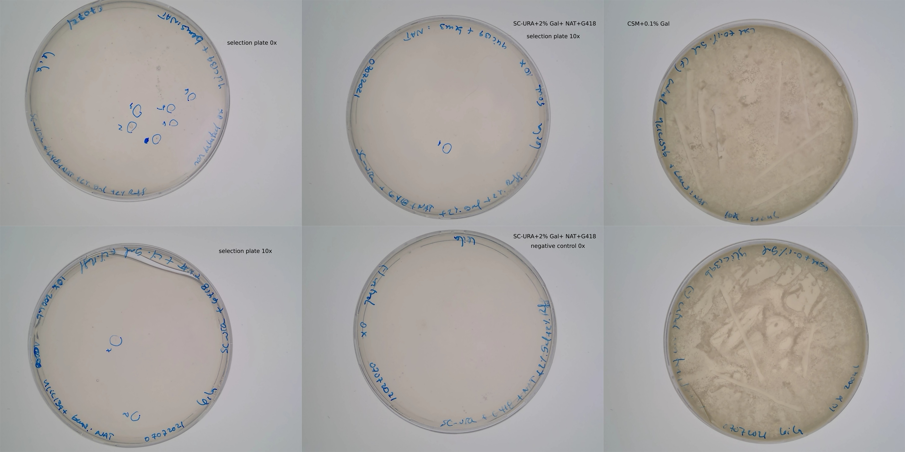
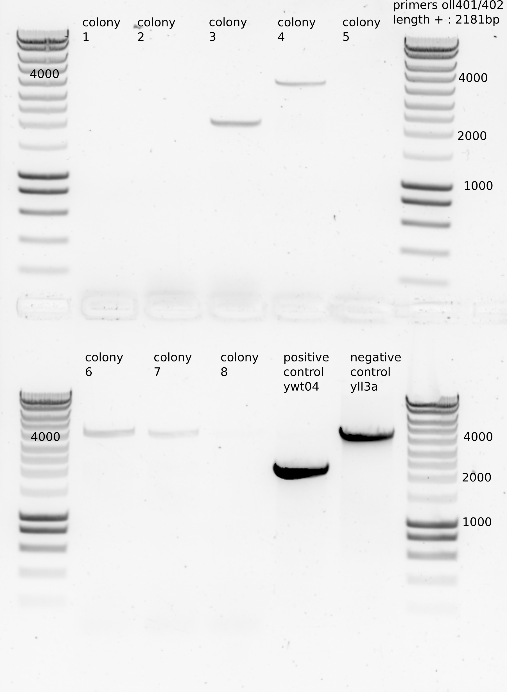

# Title : Contruction dbem1dbem3+pGal from ylci139

## Date

30062021-

## Objective

- To get a clean dbem1dbem3+pgal:CDC42 because ywkd073I and II is growing miserably.

## Method

- Transformation protocol on ylic139: ywkd071+bem1:KAnMX 
- Use ywt04gDNA with oll401/402 primers, bem3::NAT to get the PCR DNA for transformation. 
  - 1ul ywt04 template
  - Leila_60 PCR protocol
  - 8 PCR to merge and have more DNA

- [x] make 10 SC-URA(4x)+ 2%Raff+2% Gal + G418+NAT as selection plates for the transformation.  

- [x] Incubate 10ml ylic139 in 4x CSM+2% Raff +2% Gal + G418 (20ul 500X) (11:00)

- PCR purification , 4 eppis , elution 20ul for each eppi. (I used 200ul for binding buffer since the product is bigger than 2000kb)

**Note** : I should have used primers olic51/52 to build the DNA for transformation because primers olic401/402 are more used to check the location of the insertion after transformation. 

- [x] same PCR with olic51/52 for transformation 
  - the gel did not show any band .... I dont get why...
  - repeat() 

## Results

- Expected size for the PCR (though the gel was not great)

- Purified PCR concentration: 87 ng/ul , having around 75ul , which gives as a total amount approximately : 6.5ug 
- For Transformation I should around 2ug , so around 25ul .

- Expected size for the PCR with olic51/52

- Purified PCR concentration: 90 ng/ul , having around 40ul , which gives as a total amount approximately : 3.6ug 
- For Transformation I should around 2ug , so around 22ul .

### Incubation results

- Not growth after overnight liquid incubation by ylic139. 

**Change of strategy**: Plate ylic139 in CSM plates with Gal and G418 and take a single colony to inoculate in liquid culture. (01072021)

- [x] I used already made CSM+0.1%Gal that I added 1.5ml of 20% gal . Once they get dry I will add 30ul 500x G418 and streak the cells from glycerol stock. 

  - There were cells on the plate after growth during weekend, so I took two single colonies, from ylic139a and ylic139b and inoculate in 4xCSM-NF+2% Raff+2% Gal+G418 500x(20ul) at 9:30.

### Transformation

- OD measurement on 06072021

| Time           | Strain    | OD- 2x diluted | real OD |
|----------------|-----------|----------------|---------|
| 11:00/06072021 | ylic139_a | 0.275          | 0.55    |
|                | ylic139_b | 0.137          | 0.27    |
| 15:00/06072021 | ylic139_a | 0.279          | 0.56    |
|                | ylic139_b | 0.222          | 0.44    |
| 08:45/07072021 | ylic139_a | 0.3            | 0.6     |
|                | ylic139_b | 1.127          | 2.24    |

- [x] Transformation with PCR (ywt04/olic51/52) on 07072021

  - 25ul of DNA from purified PCR -> 25ul*90ng/ul=2.25ug
  - Recovery step , from 10:30->12:30 in 4x CSM+2% Raff +2% Gal
  - Plating:
    - selection plates: SC-URA(4x)+ 2%Raff+2% Gal + G418+NAT
    - After the recovery I centrifuged the samples and resuspend them in 100ul MiliQ .
      - I plated the transformed cells 50ul from this tube , 0X dilution.
      - I added 950 ul MiliQ to the rest and plate 50ul in one plate and 200ul in other one.
      - Plate 200ul in CSM+0.1% Gal to check viability. 
      - Plate 50ul of 0x non transformed cells in selection plates.
      - Plate 200ul of 10x non transformed cells in CSM+0.1% Gal to check for viability. 

- Transformation plates

  - Very few colonies , it seems it was a hard transformation. 
- Colony PCR

  - 8 colonies, colony 2 and 3 were big , the rest small.
  - Transfer colonies/ streak into CSM+0.1% Gal + NAT 
  - 5ul MiliQ suspension, 10ul MiliQ for the big colonies
  - 1ul used for PCR (LEILA_60)

  

  - colony 3 seems the only right , which was a big colony. See the growth in CSM+0.1% Gal +NAT to store it in glycerol stock. 

## Conclusion

- The dna is ready for transformation 
