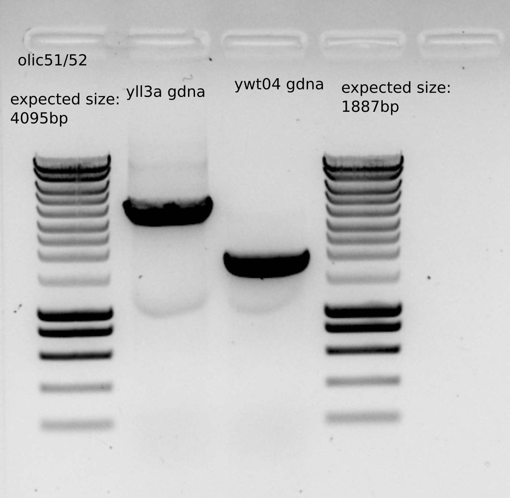

# Title : Contruction dbem1dbem3+pGal from ylci139

## Date

30062021-

## Objective

- To get a clean dbem1dbem3+pgal:CDC42 because ywkd073I and II is growing miserably.

## Method

- Transformation protocol on ylic139: ywkd071+bem1:KAnMX 
- Use ywt04gDNA with oll401/402 primers, bem3::NAT to get the PCR DNA for transformation. 
  - 1ul ywt04 template
  - Leila_60 PCR protocol
  - 8 PCR to merge and have more DNA

- [x] make 10 SC-URA(4x)+ 2%Raff+2% Gal + G418+NAT as selection plates for the transformation.  

- [x] Incubate 10ml ylic139 in 4x CSM+2% Raff +2% Gal + G418 (20ul 500X) (11:00)

- PCR purification , 4 eppis , elution 20ul for each eppi. (I used 200ul for binding buffer since the product is bigger than 2000kb)

**Note** : I should have used primers olic51/52 to build the DNA for transformation because primers olic401/402 are more used to check the location of the insertion after transformation. 

- [x] same PCR with olic51/52 for transformation 
  - the gel did not show any band .... I dont get why...
  - repeat() 

## Results

- Expected size for the PCR (though the gel was not great)

- Purified PCR concentration: 87 ng/ul , having around 75ul , which gives as a total amount approximately : 6.5ug 
- For Transformation I should around 2ug , so around 25ul .

- Expected size for the PCR with olic51/52

- Purified PCR concentration: 90 ng/ul , having around 40ul , which gives as a total amount approximately : 3.6ug 
- For Transformation I should around 2ug , so around 22ul .
### Incubation results

- Not growth after overnight incubation by ylic139 

**Change of strategy**: Plate ylic139 in CSM plates with Gal and G418 and take a single colony to inoculate in liquid culture. 

- [x] I used already made CSM+0.1%Gal that I added 1.5ml of 20% gal . Once they get dry I will add 300ul 500x G418 and streak the cells from glycerol stock. 

## Conclusion

- The dna is ready for transformation 
