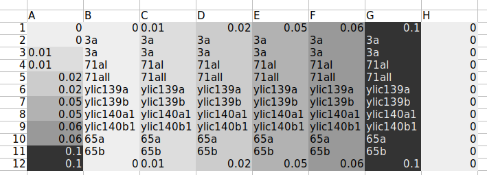
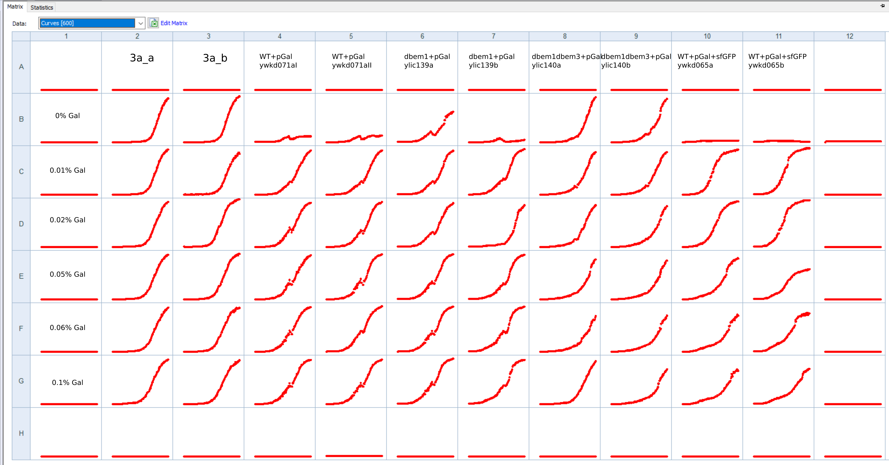
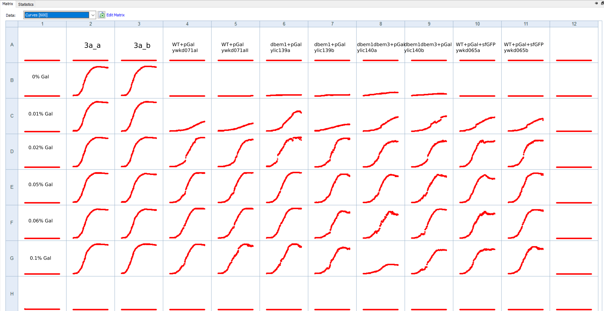

# Title: Biotek to test ylic140 dbem3dbem1pGal strain

## Date

01082021-06082021

## Objective

- To test the new dbem1dbem3 +pGal strain in different Gal concentrations. 

## Method

- 1ul of glycerol stock in 100ul media
- incubation in 30C in the biotek
- Media base: 4xCSM-NF+2%Raff
    
- Plate layout:

## Results

- End of incubation , after 48 hours 

- Dilution and start measuring

  - 1ul of incubated culture into 100ul fresh media 
  - 36C protocol 

- ylic140a/b did not grow in 0% Gal !!! 
  
## Conclusion