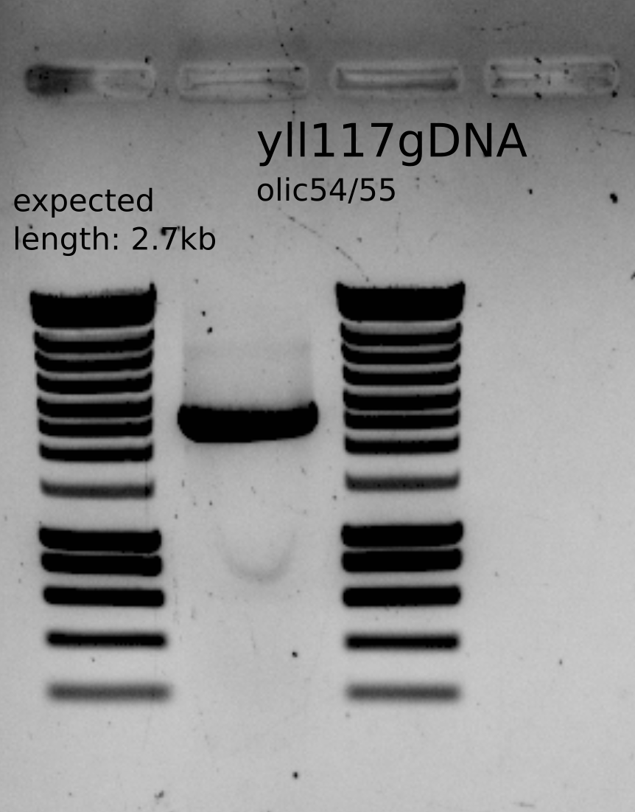

# Title: Transformation/checking on ylic136 and ylic138 with bem1::KANMX 

## Date

11082021-

## Objective

- To get the strain $\Delta$nrp1 $\Delta$bem1 and $\Delta$nrp1 $\Delta$bem3 $\Delta$bem1 for SATAY

## Method

### Materials

- Purified PCR product containing bem1::KanMX with homology arms. 
  - PCR product from yll117 and olic54/55 
  - PCR purified product : 233ng/ul 
  - Volume: 29uL 
  - Total: 6.7ug 

- Selection plates 
  - Fresh plates of YPD+6xADE+HYGRO+G418 and +/- NAT 

### Transformation 

- Yeast transformation protocol 
- 11082021, at 17:00 : Incubation of ylic136 and ylic138 in fresh liquid YPD+6xade + corresponding antibiotics. 
- Transformation on 13082021 :
  - OD 10x dilution: 
    - ylic136: 0.9 > OD ~10 
    - ylic138: 0.9 > OD ~10 

  - at 10:00 - I diluted the cultures 10X to reach an OD ~ 1 and start transformation once it reaches OD ~2 . 
  - After dilution the cultures had OD ~ 0.1 for a 10x diluted OD measurement culture, so the real OD ~1. 
  - Measure at 13:00 again  
    - OD: ylic136: 1.5, ylic138: 1.7
  - use 14.5 ul PCR product for ylic136 which is 3.4 ug of DNA and around 10ul for ylic138 which is 2.3ug . 
  - recovery step : 1 hour in YPD+6xADE
  - Plating 100ul of non diluted in selection plates, and 100u lof 100X diluted in selection plates, as well as the undiluted negative control. 

## Results

### Transformation plates 

- The negative control for the case of ylic138 is full of colonies which could imply:
  - I made a mistake and I plated a positive control  as a negative control . 
    - Resolve with colony PCR
    
- For the case of ylic136 the negative control is blank as expected. And there are many colonies for the positive control. 

### Colony PCR

- Selected 5 colonies from each genotype and also 3 colonies from the negative control of ylic138+bem1::kanmx
- Dissolve in 10ul each colony and plate them in the same selection plates **with** extra added G418
- Use 1ul for PCR
- Use olic56/olic57 primer set to check the right location of the cassette in the genome. 

#### Results from the plating of the colonies used for colony PCR

- The plates dont show growth after overnight growth. 

#### 2nd Colony PCR

- I took three new colonies from each genotype and also the colonies took previously to do a PCR with olic56/oll30 to check the upstream part of the KanMX casette. 
- I replated the new colonies in the same selection plates **without** extra added G418. I took 1ul of dissolved colonies in 10ul MiliQ.  
  - I also plated the previous colonies dissolved in 10ul MiliQ and stored in 4C in eppis . I took 1ul for plating. 
  
- So in total for PCR I have 8 colonies for ylic141 and ylic142 and 3 colonies from the negative control that grows for ylic138 and yll3a as a negative control for the KanMx cassete. 

On 30082021:

- Inoculate colony 1,4,5 and 6 from ylic141 in YPD+6x+HYGRO+G418
- Inoculate colony 1,2,5 and 6 from ylic142 in YPD+6x+NAT+HYGRO+G418

  - They did not grow after overnight culture....

On 31082021:

- Take another colony from the same restreak (same colonies as before), and dissolve it in 10ul MiliQ , take 5ul for inoculation in YPD+6xADE+G418, and 1ul for another colony PCR. 

### Repeat of the colony PCR with a positive control 

I suspect that the selection plates did not contain enough antibiotics to select on, that could be why the colonies do not grow on the restreaks with extra G418, and for the ones that grew with no extra G418 , the colony PCR did not show a KanMx cassete integration. 

### Multiple colonies retrestreak to new plate with extra G418

- I took many colonies from the original selection plate into a new plate with extra G418 , to see if at least some colonies regrow, if not , REPEAT TRANSFORMATION WITH PLATES WITH ANTIBIOTICS ADDED AFTER PLATING.  

  - Some grew , and I did colony PCR on 4 of them

  

### Plating positive and negative controls to check the plates used for selection

Positive controls: yEK7a,YWKd017
Negative controls: yll3a, ylic139,ylic140

- yll3a grew on YPD+6xade+HYGRO+G418 , so it means those plates did not have enough antibiotics to select on... 

- Also the HYGRO was in a lower concentration because the stock is diluted 250x instead of 1000x as I used for. 

### Plating of the colonies selected for colony PCR

- All colonies from ylic142 seem fine 
- ylic141 looks a bit confusing

### Incubation of single colonies 

- Incubation in 10ml YPD+ADE+G418 of all ylic142 colonies and colony 2 and 4 from ylic141 for glycerol stocks and gDNA and PCR.

### gDNA extraction and PCR

- From this gel we can see that clones 2 and 4 from ylic141 and clones 1 and 4 from ylic142 are correct.

### Final check on plate and PCR the other markers

- Streak the glycerol stock on YPD+ade+all antibiotics , with a negative (yll3a) and a positive control (ywkd017).
  - No growth also for the positive controls so it could be the plates 
- Incubation in liquid media over the weekend with antibiotics
  - Yes, all stocks did grow.
- Do a PCR to check bem3::NAT and nrp1::HYGRO

{#fig:gel}

### PCR to send to sequence the bem1::KanMx casette

## Conclusion

