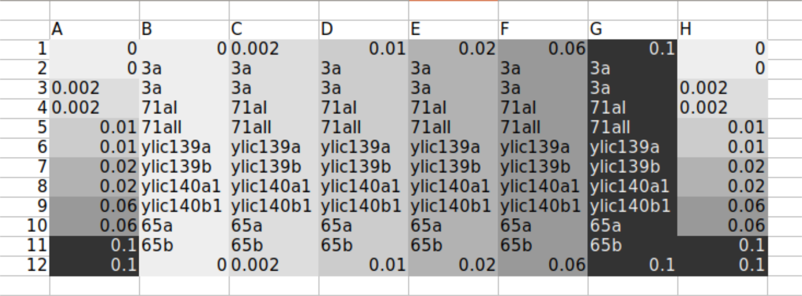
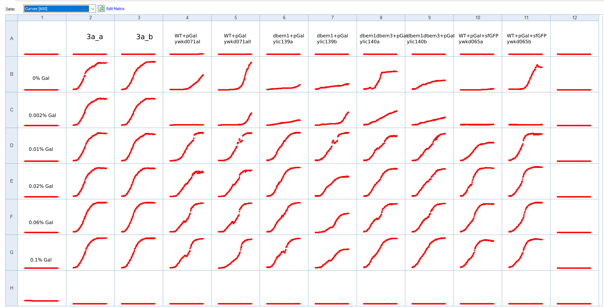
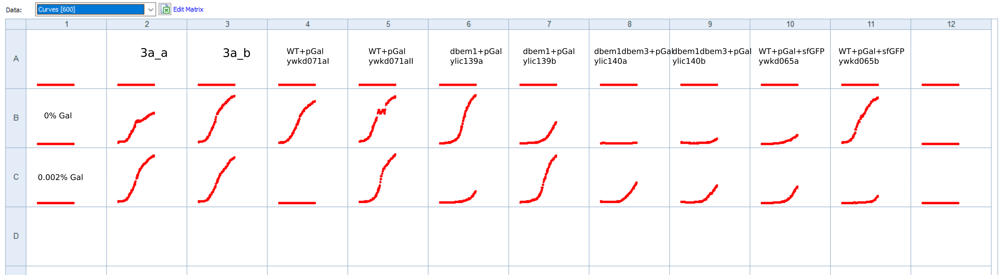
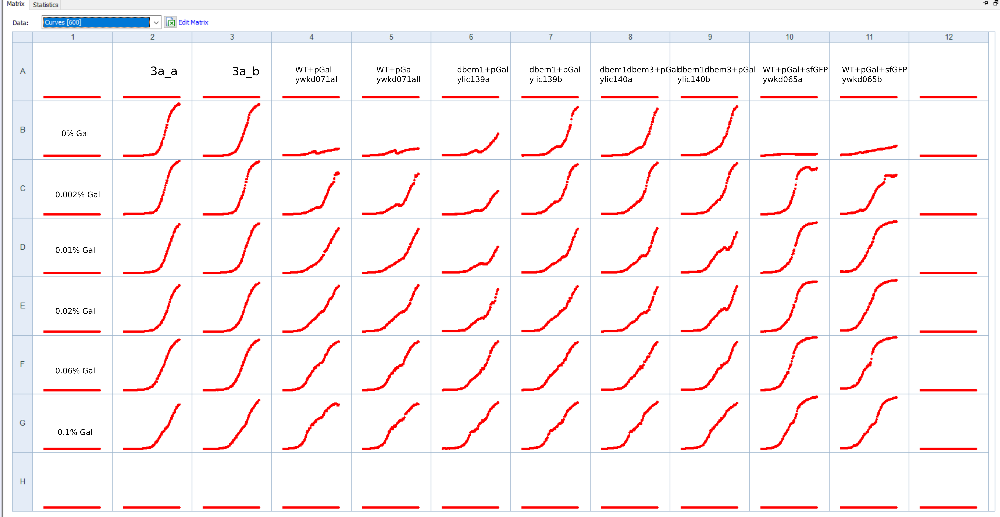
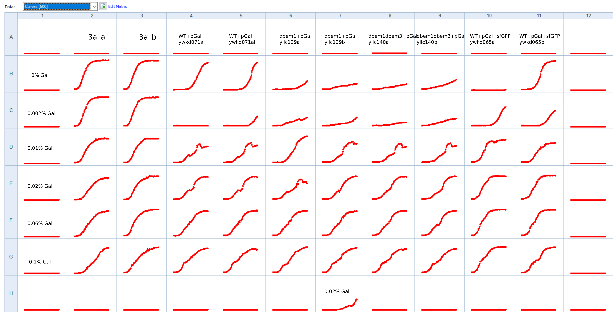

# Title: Biotek 30C with new Gal concentration below 0.1%

## Date

30082021-18092021

## Objective

- To measure all gal strains in 30C, and to measure a gal concentration below 0,1%

## Method

- 1ul of glycerol stock in 100ul media
- incubation in 30C in the biotek
- Media base: 4xCSM-NF+2%Raff
    
- Gal concentrations: 0,0.002,0.01,0.06,0.1
- Plate layout:

- Measuring : 
  - 1ul of grown culture to 100ul media 
  - Measuring at 30C 

## Results

- It is confusing that , for example for the WT strain with the gal promoter there is growth at 0% but very little and some times none in 0.002%. 

### Repeat the experiment with new fresh media 

- Make new media 4xCSM-LF+2% Raffinose 
- 1ul of glycerol stock in 100ul media
- incubation in 30C in the biotek

