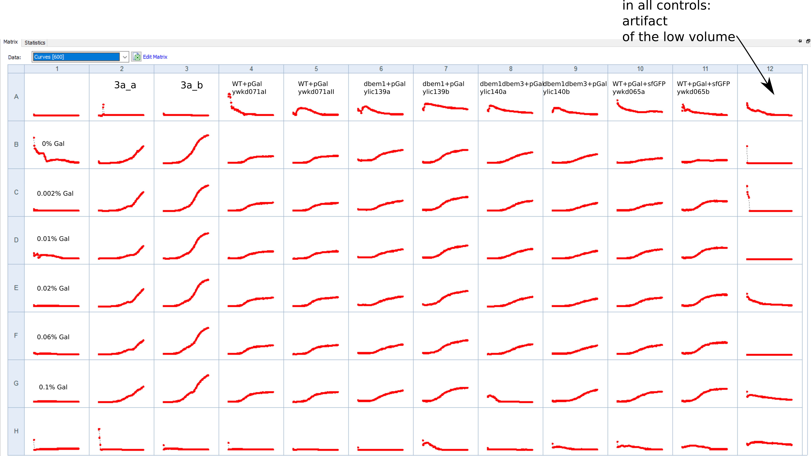
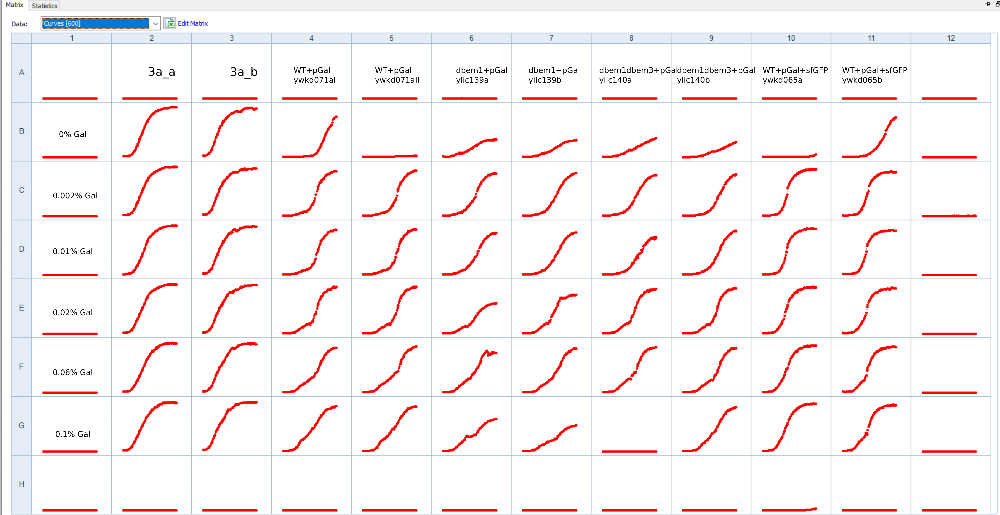

# Title : Biotek volume reduced during incubation at 30C to check supressors

## Date

28092021-03102021

## Objective

- To see if the raise of suppresors is prevented if the volume of the well is reduced , and also the number of cells to start with are increased.

## Method

- 10 ul of glycerol stock in 30 ul media
- incubation in 30C in the biotek
- base media: 4xCSM-LF+2% Raffinose 

Note: With 30uL media still the bottom of the weel is not fully covered by the media. This affect the OD measurements because there are empty spots in the well. 

### For measuring

- 1ul from incubation plate in 100ul media
- incubation in 30C in the biotek
- base media: 4xCSM-LF+2% Raffinose 

## Results

- We can see weird curve shapes for the control rows which are given to the low measurement volume and not by contamination . The wells were checked afterwards in the media for transparent.

## Conclusion

