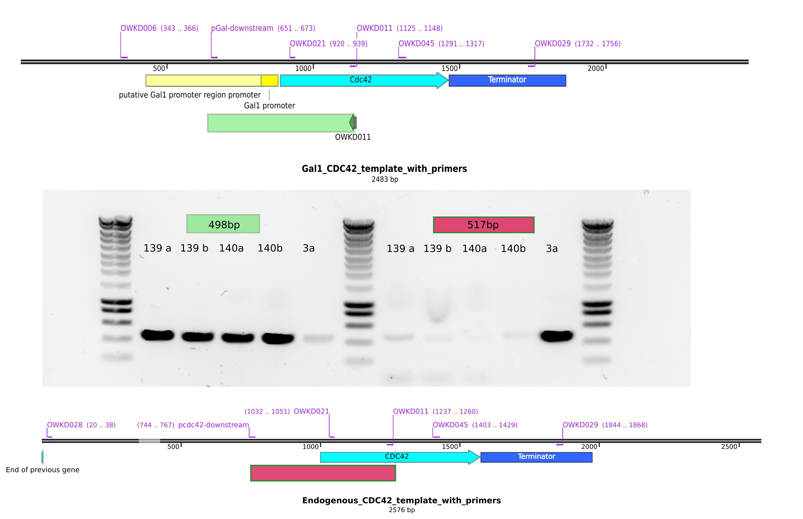

# Title : Genetic checks for the Gal strains used in the Biotek

## Date

30092021-

## Objective

- To check for the presence of the pgal promoter in front of CDC42 for the gal strains 
- To check for the abscense of the endogenous CDC42 promoter in the gal strains. 
- To check for the abscense of BEM1 and BEM3 in the mutants . 

## Method

- gDNA extraction of ywkd065 a/b and ywkd071I/II
- PCR 
- Primers : 

## Results

- gDNA extraction
    - Using 3 eppies with 2mL of culture for pellet 
    - Elution of 20ul per eppi

| strain    | concentration |
|-----------|---------------|
| ywkd065a  | 47.6ng/ul     |
| ywkd065b  | 51ng/ul       |
| ywkd071I  | 40ng/ul       |
| ywkd071II | 40ng/ul       |

- There is are suspicious bands when checking the cdc42 promoter. The primer pCdc42 downstream does not bind to the pgal construct DNA, hence I do not get the presence of this band...

- It is streaking that the mutants ylic139 and ylic140 do have BEM1!!!! (aneuploidy???)
- It seems ywkd071I does not have the endogenous CDC42 promoter. So it is good.

**Important note**

- The primers olic60/61 were wrong!!! they were binding to kanmx cassette instead of BEM1. That explains the bands in the mutants..
- I ordered new primers that bind to BEM1 upstream and downstream . Let see.. 

### PCR on control strains

- original strain used for transformation (yll117) does not show a band for BEM1. This is good. 
- The strain from Thomas ytw001: $\Delta$bem1$\Delta$bem3 seems to have both (**I dont understand this**), also my strains ylic141/ylic142 , 
$\Delta$bem1$\Delta$nrp1/$\Delta$bem1$\Delta$bem3$\Delta$nrp1

#### DNA extraction for ywkd017

ywkd017: 

  - $\Delta$bem1$\Delta$bem3$\Delta$nrp1 
  - Positive control for all markers 
  - gDNA concentration: 76ng/ul , 80ul Volume 

## Conclusion

- we may repeat the BEM1 transformation for :
  - ylic139
  - ylic140
  - ylic141
  - ylic142
  - ytw001 

