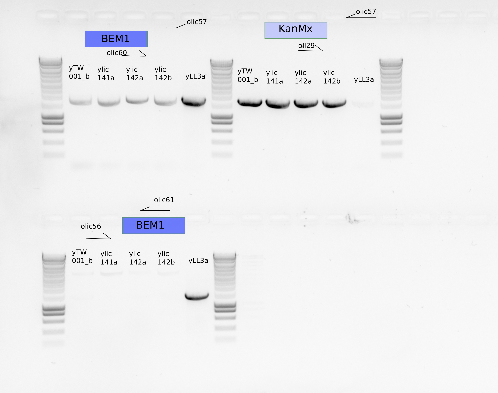

# Title : Genetic checks for a single colony from the stock of bem1:KanMx mutants

## Date

29102021- 

## Objective

- To figure it out if the stok completely is unstable , that is , all the cells are aneuploidy after bem1:kanmx transformation. 
- If not , then store a new clean glycerol stock. 

## Method

- Plate from glycerol stocks in CSM+2%Raff+2%Gal+G418 
- Plates were tested with negative(yll3a) and positive control (ywkd017)
- Take one single colony and inoculate in same liquid media over the weekend
- gDNA extraction (ylic139b,ylic140a,ylic140b,yTW001a)

    - 2 eppies per strain
    - 30ul elution
    - 42-47 ng/uL DNA concentrations 

- PCR inside BEM1 and inside KanMx
    - olic56/61, olic57/60, oll29/olic57
    - 1ul DNA 

- glycerol stocks if OK 
    - Only for yTW001a

Day 2: 

- Inoculate a 2nd colony from ylic139a(discarded)
- Analyze ylic141a,b and ylic142a,b 

## Results

### Sequencing

- PCR to prepare samples for sequencing:

  - yTW001b seems that do not have BEM1
  - I sent samples from ylic141a and ylic142a with olic60 and olic57 primers to sequencing.
  - I sent all the samples from PCR from olic56 and olic57 to sequencing.
  

- This is indicating that both strains ylic141 and ylic142 are aneuploidies, because they show the presence of PTEF from KanMx and the downstream region of BEM1 in the same strain.

## Conclusion

- The pgal mutants are unstable clones, yet, yTW001a seems to be rescued.
- To confirm that BEM1 is not in the SATAy mutants , I will sequence using olic60/olic57 and olic56/olic57 primers. 
- yWT001b seems that do not have BEM1. 
- ylic141 and ylic142 are aneuploidies.
- Repeat the transformations fro ylic141 and ylic142 ,and check for every colony the presence of Kanmx and the abscence of BEM1. 

